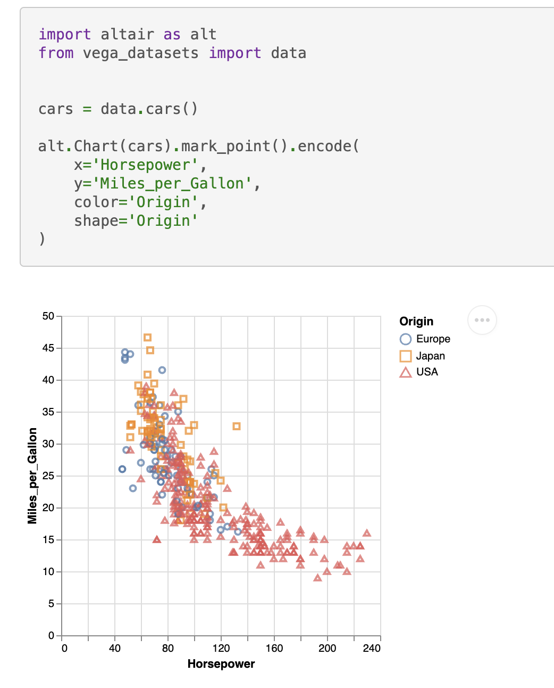

# sphinxext-altair
**sphinxext-altair** provides the directive `altair-plot` to insert live-rendered Altair plots within your Sphinx documentation:

```
    .. altair-plot::
        import altair as alt
        from vega_datasets import data


        cars = data.cars()

        alt.Chart(cars).mark_point().encode(
            x='Horsepower',
            y='Miles_per_Gallon',
            color='Origin',
            shape='Origin'
        )
```



You can find all available options in the docstring of `sphinxext_altair/altairplot.py`. For more examples on how to use this extension, see the test Sphinx documentation in `tests/roots/test-altairplot` or the official [Altair documentation](https://github.com/altair-viz/altair/tree/master/doc)


# Contributing
It's recommended to use a virtual environment for development:

```bash
python -m venv .venv
# Install the project in editable mode including development dependencies
pip install -e '.[dev]'
```

`sphinxext-altair` uses [black](https://github.com/psf/black) for code formatting, [mypy](https://github.com/python/mypy) for static type checking, [ruff](https://github.com/charliermarsh/ruff) for various linting rules, and [pytest](https://github.com/pytest-dev/pytest) for testing. All these tools can be executed by running:

```bash
hatch run test
```

As part of those tests, a Sphinx documentation is built at `tests/roots/test-altairplot`. You can manually build this documentation and view it which is very useful during development of a new feature. For example, if you want to add a new option to the `altair-plot` directive, you can add another example in the file `tests/roots/test-altairplot/index.rst` and then build and view the documentation by running:

```bash
hatch run build-test-docs
hatch run serve-test-docs
```

The test documentation can now be viewed at [http://localhost:8000](http://localhost:8000).
